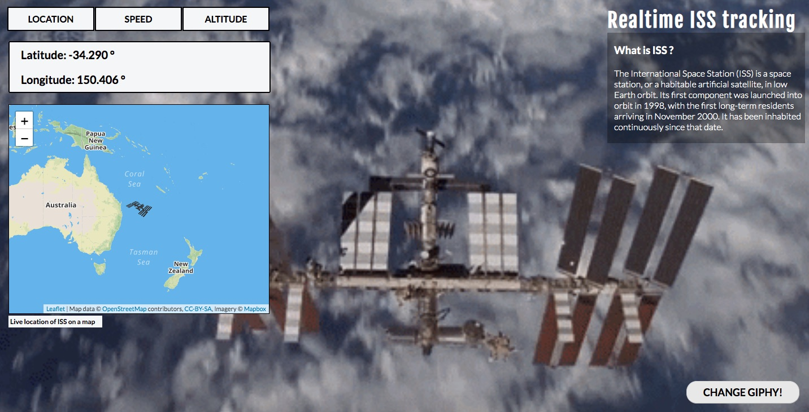

# ISS - tracker with GIPHY!

Tracks the coordinates, velocity and altitude of the International Space Station.



# API

#### ISS data

https://whereistheiss.at/w/developer

#### Giphy API

https://developers.giphy.com

#### Map [leaflet.js, Mapbox]

- [leaflet.js](https://leafletjs.com)
- [Mapbox](https://www.mapbox.com)

# Technology stack

#### Front end

- HTML
- CSS
- Jquery

#### Backend

- Node.js
- Express

#### Deployment

- Heroku

# HTML

```html
    <html>
<head>
	<script src="https://code.jquery.com/jquery-3.4.1.min.js"
		integrity="sha256-CSXorXvZcTkaix6Yvo6HppcZGetbYMGWSFlBw8HfCJo=" crossorigin="anonymous"></script>
	<link href="styles/app.css" rel="stylesheet" type="text/css" />
	<link href="https://fonts.googleapis.com/css?family=Fjalla+One|Lato:300,400,700&display=swap" rel="stylesheet" />
	<script src="https://kit.fontawesome.com/10e34b165f.js"></script>
	<link rel="stylesheet" href="https://unpkg.com/leaflet@1.5.1/dist/leaflet.css"
		integrity="sha512-xwE/Az9zrjBIphAcBb3F6JVqxf46+CDLwfLMHloNu6KEQCAWi6HcDUbeOfBIptF7tcCzusKFjFw2yuvEpDL9wQ=="
		crossorigin="" />
	<script src="https://unpkg.com/leaflet@1.5.1/dist/leaflet.js"
		integrity="sha512-GffPMF3RvMeYyc1LWMHtK8EbPv0iNZ8/oTtHPx9/cc2ILxQ+u905qIwdpULaqDkyBKgOaB57QTMg7ztg8Jm2Og=="
		crossorigin=""></script>
</head>

<body>
	<main>
		<div id="api-content">
			<div id="menu">
				<ul>
					<li id="location">Location</li>
					<li id="speed">Speed</li>
					<li id="altitude">Altitude</li>
				</ul>
			</div>
			<div id="result"></div>

			<div id="mapid"></div>
			<h3 id="map-text">Live location of ISS on a map</h3>
		</div>
		</div>
		<div id="info-text">
			<h1>Realtime ISS tracking</h1>
			<div id="iss-info-container">
				<h3>What is ISS ?</h3>
				<p>
					The International Space Station (ISS) is a space station, or a
					habitable artificial satellite, in low Earth orbit. Its first
					component was launched into orbit in 1998, with the first long-term
					residents arriving in November 2000. It has been inhabited
					continuously since that date.
				</p>
			</div>
			<button id="change-giphy">Change giphy!</button>
		</div>
	</main>
	<footer>
		<div class="social_icons_container">
			<a href="https://www.instagram.com/00ritikbhardwaj00"><i class="fab fa-instagram"></i></a>
			<a href="https://www.facebook.com/ritik.bhardwaj.129"><i class="fab fa-facebook"></i></a>
		</div>
		<p>Designed and developed by Ritik Bhardwaj</p>
		<p>All rights reserved | 2019</p>
	</footer>
	<script src="scripts/app.js"></script>
</body>

</html>
```

# CSS

```css
* {
  padding: 0;
  margin: 0;
  /* font-family: 'Fjalla One', sans-serif; */
  font-family: "Lato", sans-serif;
}

body {
  /* background-image: url('https://images.unsplash.com/photo-1447433865958-f402f562b843?ixlib=rb-1.2.1&ixid=eyJhcHBfaWQiOjEyMDd9&auto=format&fit=crop&w=1504&q=80'); */
  background-image: url("https://media.giphy.com/media/WtfrF8owsyz6alCkyg/giphy.gif");
  /* background-image: url('https://media.giphy.com/media/giW9XESwOrCeY/giphy.gif'); */
  overflow-x: hidden;
  background-position: center;
  background-size: cover;
}

main {
  display: flex;
}

.api-info h1 {
  color: black;
  padding-top: 5px;
  padding-bottom: 5px;
  padding-left: 20px;
  padding-right: 20px;
  font-size: 20px;
}

div#api-content {
  flex: 3;
  height: 100vh;
}

div#api-content h3#map-text {
  background: rgb(245, 246, 247);
  padding: 3px;
  font-size: 12px;
  margin-left: 20px;
  width: 160px;
  margin-bottom: 0px;
  margin-top: 3px;
}

div#info-text {
  flex: 1;
  display: flex;
  align-items: center;
  flex-direction: column;
  height: 100vh;
  min-width: 360;
}

div#info-text h1 {
  color: white;
  font-family: "Fjalla One", sans-serif;
  font-size: 35px;
  margin-top: 20px;
  letter-spacing: 2px;
  align-self: flex-start;
}

div#info-text #iss-info-container {
  background: rgba(0, 0, 0, 0.3);
  margin-right: 10px;
}

div#info-text h3 {
  align-self: flex-start;
  margin-left: 12px;
  color: white;
  margin-top: 20px;
}

div#info-text p {
  align-self: flex-start;
  margin-left: 12px;
  color: white;
  margin-top: 20px;
  font-weight: 100;
  margin-bottom: 20px;
}

/* ------ Menu styling ------ */

div#api-content ul {
  display: flex;
  align-items: center;
  margin-top: 20px;
  margin-left: 20px;
}

div#api-content ul li {
  background-color: rgb(245, 246, 247);
  list-style: none;
  padding-top: 10px;
  padding-bottom: 10px;
  margin-right: 5px;
  font-size: 16px;
  width: 150px;
  display: flex;
  justify-content: center;
  border-radius: 1px;
  font-weight: bold;
  cursor: pointer;
  text-transform: uppercase;
  outline: 2px black solid;
}

/*  --- ISS api data result styling --- */

div#api-content div#result {
  background-color: rgb(245, 246, 247);
  width: 460px;
  /* height: 100px; */
  margin-left: 20px;
  margin-top: 20px;
  border-radius: 3px;
  display: flex;
  align-items: flex-start;
  justify-content: center;
  flex-direction: column;
  border: 2px solid black;
}

/* Map styling */

div#api-content div#mapid {
  height: 370px;
  width: 460px;
  margin-left: 20px;
  margin-top: 20px;
  z-index: 10;
  border: 1px solid black;
}

div#api-content div#result h3 {
  font-size: 20px;
  font-weight: bold;
  margin-left: 20px;
  padding-top: 10px;
  padding-bottom: 10px;
}

/* Change Giphy button styling */

button#change-giphy {
  position: absolute;
  bottom: 0px;
  right: 0px;
  width: 200px;
  height: 40px;
  margin: 20px;
  background-color: rgba(232, 232, 232);
  font-size: 18px;
  text-transform: uppercase;
  font-weight: bold;
  border-radius: 18px;
  cursor: pointer;
}

/* ----- footer styling ----- */

footer {
  height: 100px;
  width: 100%;
  background-color: rgb(232, 232, 232);
  z-index: 100;
  display: flex;
  flex-direction: column;
  justify-content: flex-end;
  align-items: center;
}

footer .social_icons_container a i {
  font-size: 25px;
  margin-bottom: 5px;
  margin-left: 20px;
  color: black;
}

footer a i.fa-instagram:hover {
  transform: translateY(-5px);
  color: rgba(255, 50, 0, 0.7);
  transition: all 0.3s;
}

footer a i.fa-facebook:hover {
  transform: translateY(-7px);
  color: #3b5998;
  transition: all 0.3s;
}

footer .social_icons_container {
  margin-bottom: 5px;
}

footer p {
  margin-bottom: 5px;
}
```

# Javascript

```javascript
$(document).ready(() => {
  const url = "https://api.wheretheiss.at/v1/satellites/25544";
  printInfo(0);

  // Initializing the map
  const mymap = L.map("mapid").setView([0, 0], 3);
  // Change the map icon
  const myIssIcon = L.icon({
    iconUrl: "../images/200iss.png",
    iconSize: [50, 32],
    iconAnchor: [25, 16]
  });
  const marker = L.marker([0, 0], { icon: myIssIcon }).addTo(mymap);
  //Add mapbox tiles
  L.tileLayer(
    "https://api.tiles.mapbox.com/v4/{id}/{z}/{x}/{y}.png?access_token=pk.eyJ1Ijoicml0aWstYmhhcmR3YWoiLCJhIjoiY2p4cDMzbHd6MDk5eDNubzIzb28xNmNwcyJ9.NiInb99O-Fa_BvA5ZyfjwQ",
    {
      attribution:
        'Map data &copy; <a href="https://www.openstreetmap.org/">OpenStreetMap</a> contributors, <a href="https://creativecommons.org/licenses/by-sa/2.0/">CC-BY-SA</a>, Imagery © <a href="https://www.mapbox.com/">Mapbox</a>',
      maxZoom: 18,
      id: "mapbox.streets",
      accessToken:
        "pk.eyJ1Ijoicml0aWstYmhhcmR3YWoiLCJhIjoiY2p4cDMzbHd6MDk5eDNubzIzb28xNmNwcyJ9.NiInb99O-Fa_BvA5ZyfjwQ"
    }
  ).addTo(mymap);

  //to fetch the data every 3 seconds
  setInterval(() => {
    fetch(url)
      .then(response => {
        return response.json();
      })
      .then(parsedResponse => {
        var latlng = L.latLng(
          parsedResponse.latitude,
          parsedResponse.longitude
        );
        marker.setLatLng(latlng);
        mymap.panTo(latlng);
      });
  }, 3000);

  //event handler for the li's
  $("div#api-content div#menu ul").click(e => {
    if (e.target !== e.currentTarget) {
      if (e.target.id === "location") {
        printInfo(0);
      } else if (e.target.id === "speed") {
        printInfo(1);
      } else if (e.target.id === "altitude") {
        printInfo(2);
      }
    }
    e.stopPropagation();
  });

  $("button#change-giphy").click(() => {
    var index = Math.floor(100 * Math.random());
    changeGiphy(index);
  });

  function changeGiphy(index) {
    //ajax call to the api using jquery ajax
    $.ajax({
      url:
        "https://api.giphy.com/v1/gifs/search?api_key=QNMAgj5xQCnIARW3YiQ24rmuVqQSWS1r&q=nasa+iss&limit=100&offset=0&rating=G&lang=en"
    }).done(data => {
      console.log(data.data[0].images.original.url);
      $("body").css(
        "background-image",
        `url(${data.data[index].images.original.url})`
      );
    });
  }
  //function to print the data onto the DOM
  function printInfo(number) {
    fetch(url)
      .then(response => {
        return response.json();
      })
      .then(response => {
        // finalResponse = parsedResponse;
        // printInfo(number, finalResponse);
        if (number === 0) {
          $("div#api-content div#result").html(`
        <h3>Latitude: ${response.latitude.toFixed(3)} &deg</h3>
        <h3>Longitude: ${response.longitude.toFixed(3)} &deg</h3>
      `);
        }
        if (number === 1) {
          $("div#api-content div#result").html(
            `<h3>Speed: ${response.velocity.toFixed(
              3
            )} <span style="font-size: 10px;">km/h</span></h3>`
          );
        }
        if (number === 2) {
          $("div#api-content div#result").html(
            `<h3>Altitude: ${response.altitude.toFixed(
              3
            )}<span style="font-size: 10px">Km</span></h3>`
          );
        }
      });
  }
});
```
